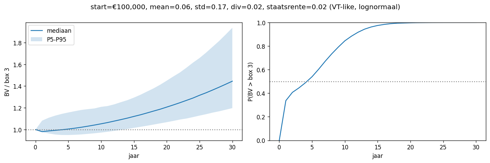
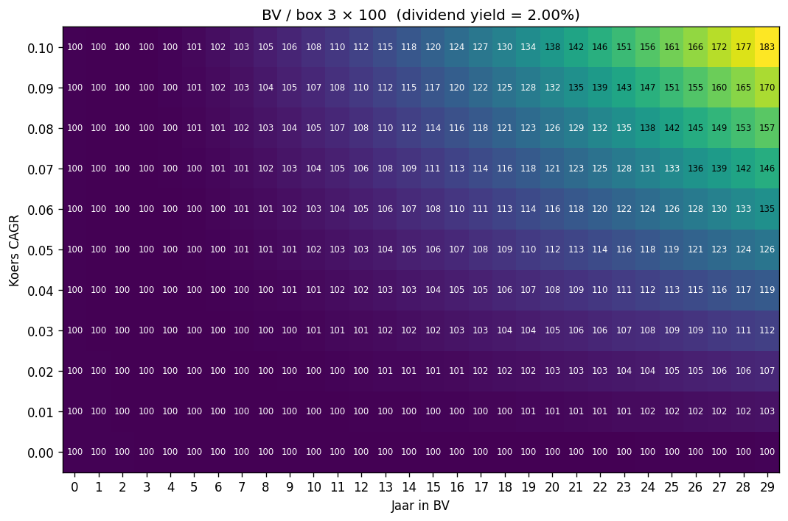
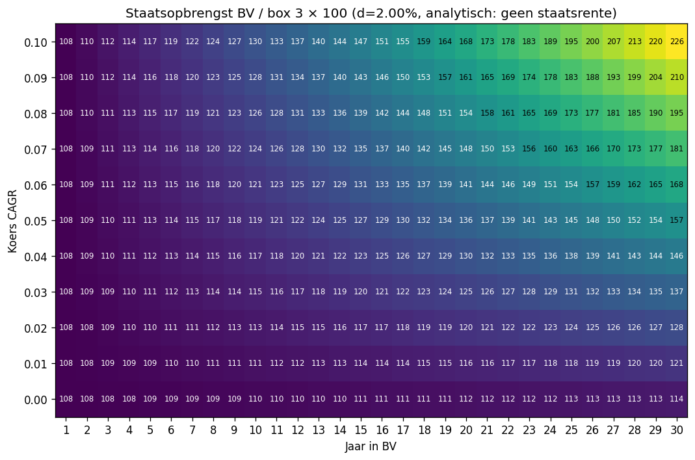
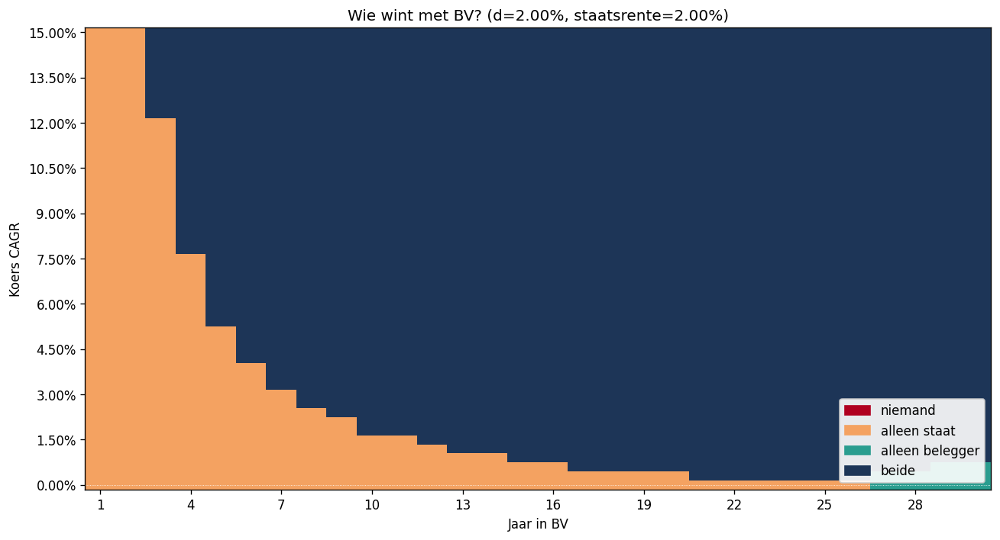

# Box 2 vs Box 3

Simulaties die de BV/box 2-route vergelijken met box 3, voor zowel belegger als staat.

## Draaien

```bash
uv run python run.py          # ratio belegger over tijd (Monte Carlo)
uv run python heatmap.py      # analytische ratio over (jaren, CAGR)
uv run python state_view.py   # staatsopbrengst + Pareto-kaart
uv run python plots.py        # alle bovenstaande in één keer naar plots/
```

## Resultaten (default-waarden)






## Modules

- `tax.py` — `Taxes` dataclass met tarieven; `DEFAULT` = box3 36%, vpb 19%, box2 24.5%, vrijstelling €1.800.
- `returns.py` — `constant`, `normal`, `lognormal`, `lognormal_from_mean_std` (kalibreert op simple-return gemiddelde + std): rendementsmatrix (T, N).
- `box3.py` — `simulate(start, returns, taxes)` → `(wealth, tax)`.
- `bv.py` — `simulate(start, growth, dividend_yield, taxes)` → `(wealth, vpb, exit_tax)`.
- `state.py` — `future_value(flow, rate)`, en `box3_cum_tax` / `bv_cum_tax` die staatsbelasting met staatsrente (default 2%) oprollen tot het eindjaar.
- `compare.py` — `run(..., state_rate=0.02)` draait beide routes; `summary(...)` levert mediaan/percentielen en winkansen.
- `analytic.py` — gesloten vorm: `ratio(years, growth, d, taxes)` en `state_ratio(...)`.
- `heatmap.py` — `plot(years, growths, dividend_yield)`.
- `state_view.py` — `plot_state_heatmap(d, taxes)`, `plot_pareto(d, taxes)`.

## Wat je ziet

- **run.py**: mediaan BV/box 3-ratio met P5–P95-band en P(BV wint) per jaar.
- **heatmap.py**: ratio per (jaar, koers-CAGR), analytisch, met celwaarden.
- **state_view.py**: staats-ratio (numeriek) en Pareto-kaart (niemand / alleen staat / alleen belegger / beide).

## Parameters om aan te passen

Pas **`.env`** aan — alle defaults staan daar (belastingtarieven, staatsrente, markt-kalibratie, `YEARS`/`SIMS`/`START`/`SEED`). `config.py` laadt ze en alle scripts lezen daaruit.

Alleen als je per-call wil afwijken: `Taxes(box3_rate=..., ...)`, `compare.run(..., state_rate=...)`, `plot_pareto(d=..., state_rate=...)`.
